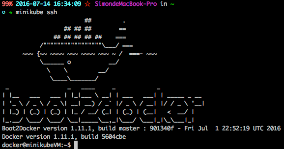

# 單機版K8S - minikube

kubernetes.io發佈了一個供本地端單機跑kubernetes最精簡的環境minikube，透過minikube可以很快速的使用與測試k8s的功能唷～

## 安裝minikube

安裝的部分要看您的主機是哪種OS，下面是Mac OS的安裝方式

```
curl -Lo minikube https://storage.googleapis.com/minikube/releases/v0.6.0/minikube-darwin-amd64 && chmod +x minikube && sudo mv minikube /usr/local/bin/
```

其他的操作部分都是使用kubectl，可以參考kubernetes的指令...

## 其他一功能

透過minikube的指令，可以看到在Mac上，其實是使用Virtualbox來啟動裝有kubernetes的boot2docker環境。

```
# ps -ef | grep minikube
 502 14260 14236 0 11:49上午 ?? 21:11.73 /Applications/VirtualBox.app/Contents/MacOS/VBoxHeadless --comment minikubeVM --startvm cb568998-d8b4-40d4-a6e7-c92aea5aee3d --vrde config
 502 18986 4258 0 3:59下午 ttys008 0:00.00 grep --color=auto minikube
```

minikube除了提供k8s環境之外，而且也連結了這些環境提供一些不錯的操控方式，這邊紀錄幾個看到還不錯用的功能...

### 檢視版本資訊

minikube version

```
# minikube version
minikube version: v0.6.0
```

k8s version

```
# minikube get-k8s-versions
The following Kubernetes versions are available:
 - v1.3.0
```

### Minikube的儀表板

```
minikube dashboard
```

此時，桌面會跳出browser的畫面，裡面是kubernetes的dashboard，這版本的dashboard已經提供了直接在網頁介面Deploy App的功能，除此之外，也可以透過yaml來作部署的動作...


### minikube docker env

這個指令提供顯示目前minikube的docker環境的連線參數，可以讓外部的docker client透過這些參數來連線minikube環境做進階操控。

```
# minikube docker-env
export DOCKER_TLS_VERIFY=1
export DOCKER_HOST=tcp://192.168.99.100:2376
export DOCKER_CERT_PATH=/Users/peihsinsu/.minikube/certs
# Run this command to configure your shell:
# eval $(minikube docker-env)
```

### 關閉與重新啟動

停掉minikube

```
# minikube stop
Stopping local Kubernetes cluster...
Machine stopped.
```

確認狀態

```
# minikube status
Stopped
```

啟動minikube

```
# minikube start
Starting local Kubernetes cluster...
Kubernetes is available at https://192.168.99.100:8443.
Kubectl is now configured to use the cluster.
```

### ssh連線到minikube虛擬主機中

要連線到minikube主機時，可以透過minikube ssh的指令...



## 使用 docker machine kvm driver 開 minikube 

[裝了kvm](https://github.com/kubernetes/minikube/blob/master/docs/drivers.md#kvm-driver)後，可以使用docker machine driver kvm 來建立minikube：

1.[準備kvm driver](https://github.com/dhiltgen/docker-machine-kvm/releases)，以Linux Ubuntu 16.04 為例:

```
$ curl -o docker-machine-driver-kvm \
  -L https://github.com/dhiltgen/docker-machine-kvm/releases/download/v0.10.0/docker-machine-driver-kvm-ubuntu16.04 \
  && chmod +x docker-machine-driver-kvm \ 
  && sudo mv docker-machine-driver-kvm /usr/local/bin
```

2. 啟動minikube 或寫入 config

單次使用：

```
$ minikube start --vm-driver=kvm
```

寫入config:

minikube config 預設路徑於 ~/.minikube/config/config.json

加入 entity : "vm-driver": "kvm" 

\[config.json\]

```
{
    "vm-driver": "kvm"
}
```

即可正常使用 minikube start 。

### 參考文件

* minikube readme: [https://github.com/kubernetes/minikube/blob/master/README.md](https://github.com/kubernetes/minikube/blob/master/README.md)
* minikube release note: [https://github.com/kubernetes/minikube/releases](https://github.com/kubernetes/minikube/releases)


